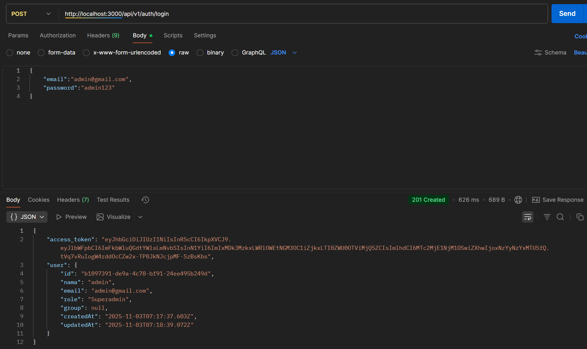
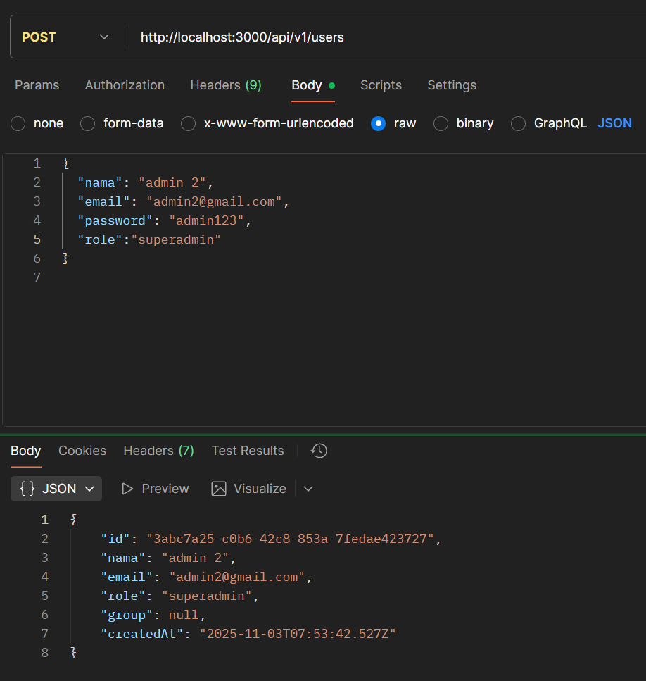
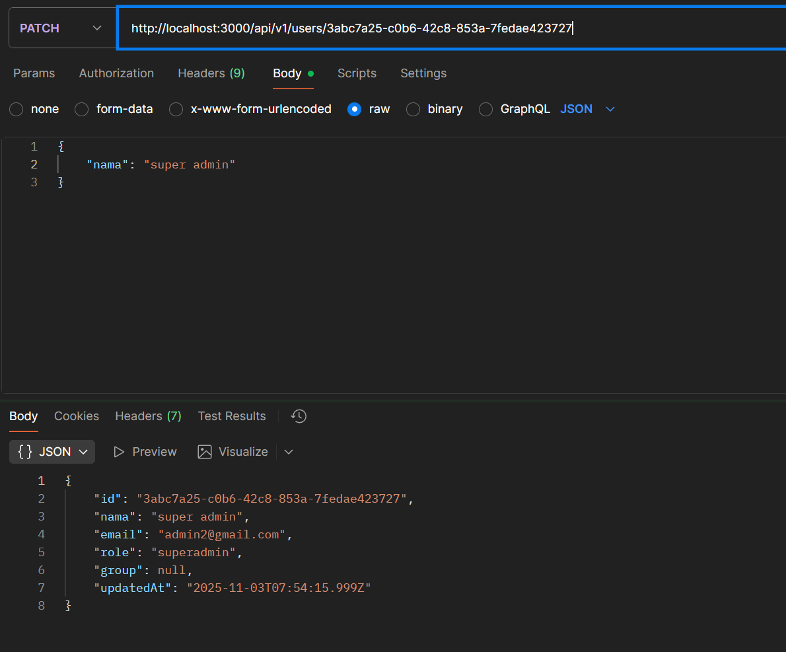
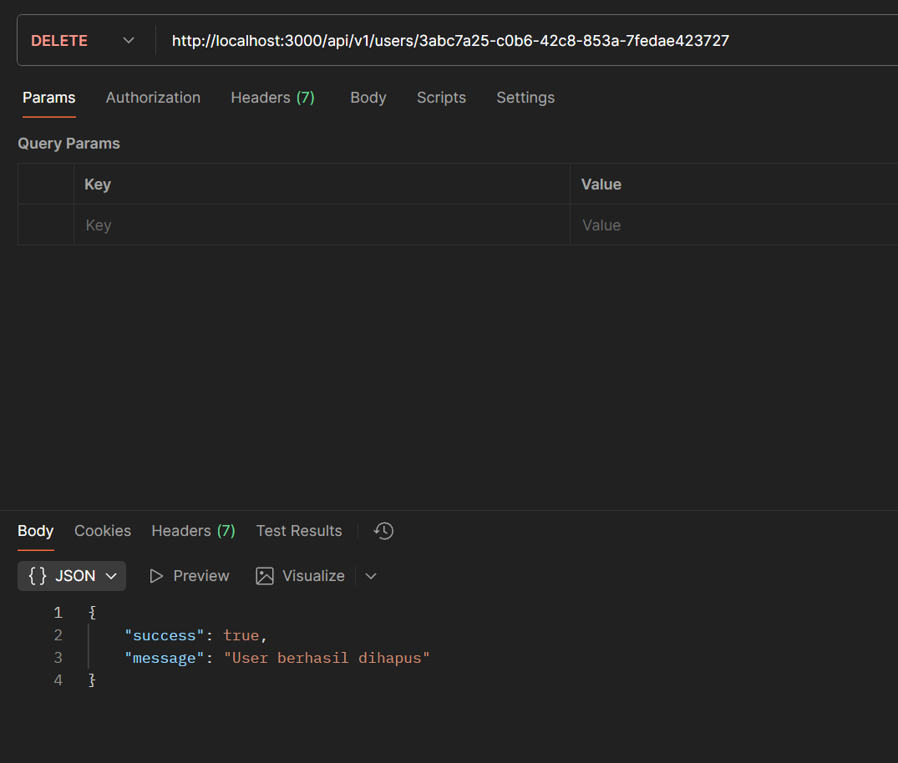
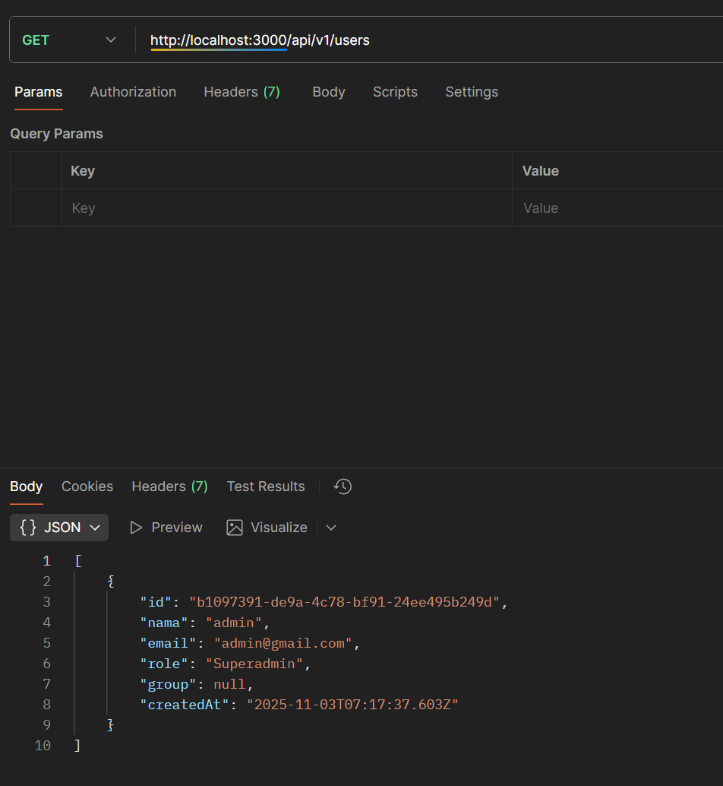
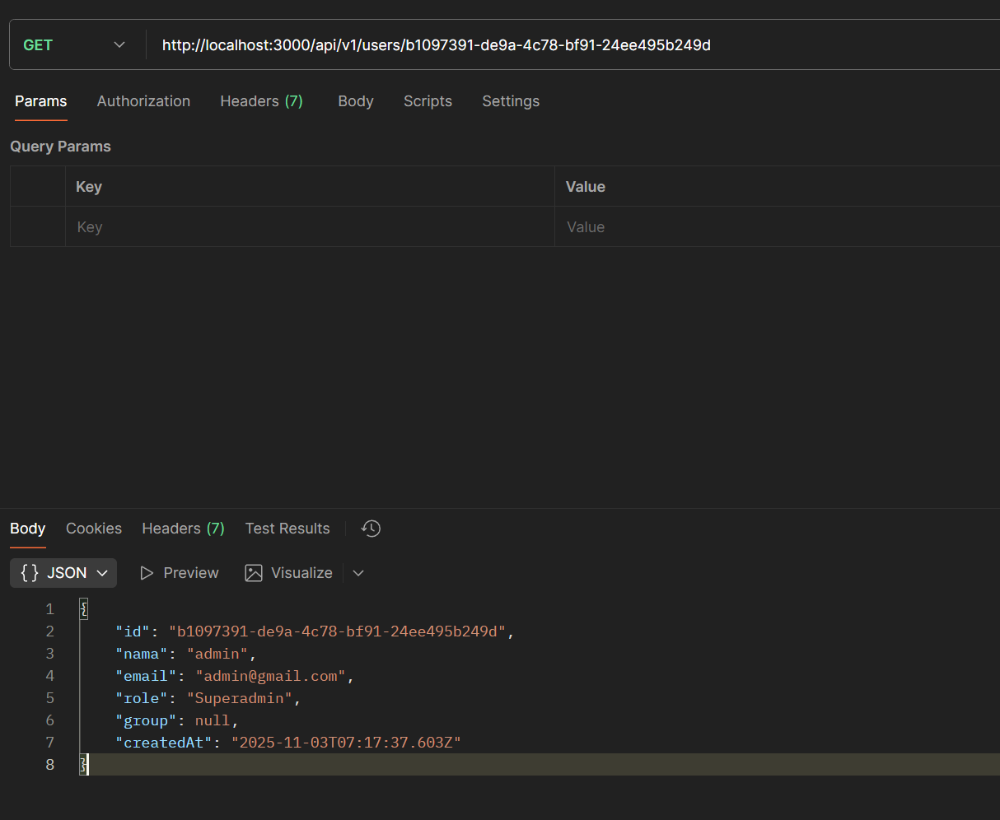
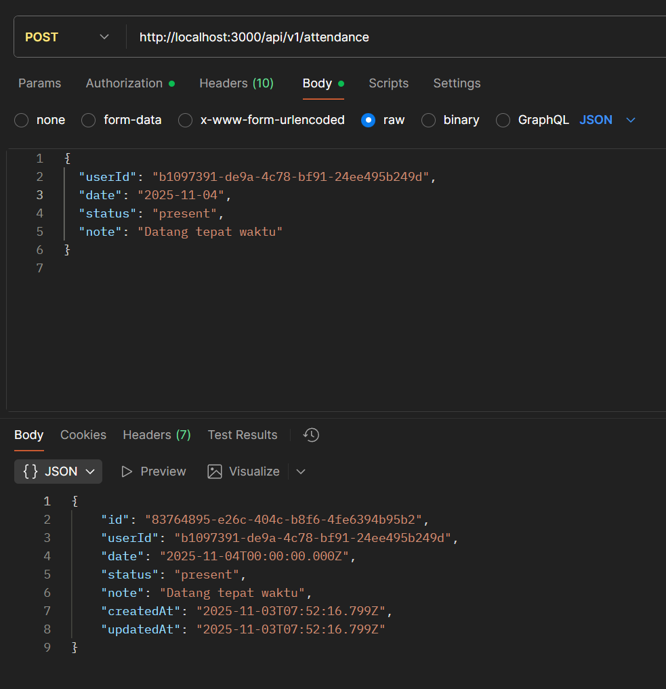
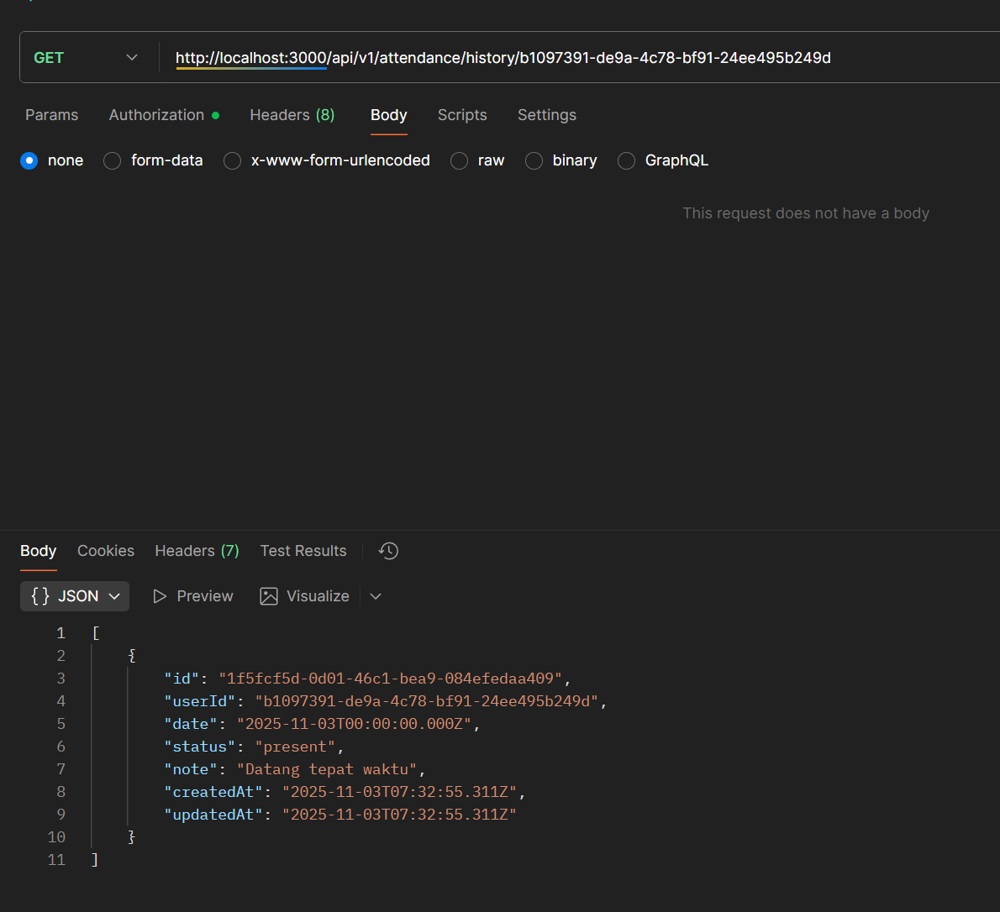
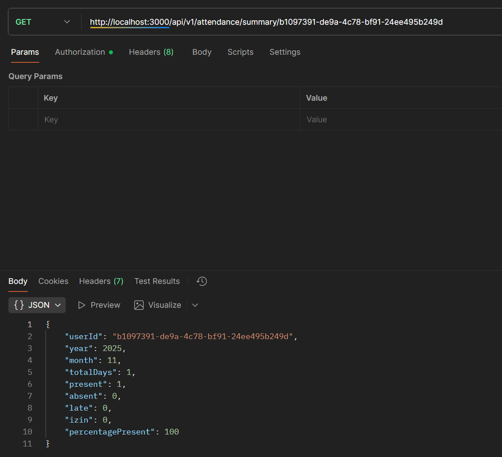
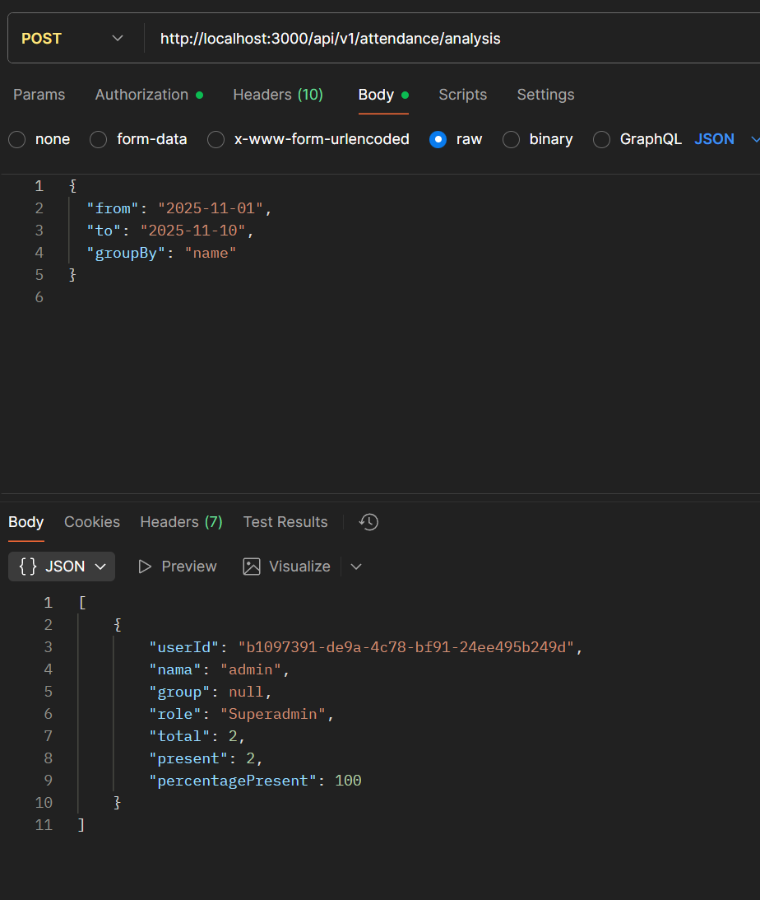

  

<h1 align="center">📘 API Presensi — NestJS + Prisma + JWT Auth</h1>

  RESTful API untuk sistem presensi berbasis <b>NestJS</b>, dilengkapi autentikasi JWT dan koneksi database menggunakan <b>Prisma ORM</b>.

  
  
  
  

---

## 🚀 Deskripsi

Proyek ini adalah **REST API Presensi** yang dibangun menggunakan **NestJS**.  
Fitur utama meliputi:

- 🔐 Autentikasi menggunakan **JWT (JSON Web Token)**
- 🧑‍💼 Manajemen pengguna (login, register, role-based access)
- 🕒 Pencatatan dan validasi presensi
- 🧩 Integrasi database menggunakan **Prisma ORM**
- 🧱 Arsitektur modular (Auth, Users, Presensi, dsb.)

---

## 🛠️ Tech Stack

| Teknologi | Deskripsi |
|------------|------------|
| **NestJS** | Backend framework berbasis Node.js |
| **Prisma** | ORM untuk database SQL (MySQL, PostgreSQL, dsb.) |
| **Passport + JWT** | Autentikasi dan otorisasi |
| **TypeScript** | Bahasa utama |
| **Dotenv** | Manajemen environment variables |

---

## 📂 Struktur Proyek

src/
├── auth/
│ ├── auth.controller.ts
│ ├── auth.service.ts
│ ├── jwt.strategy.ts
│ └── jwt-auth.guard.ts
├── users/
│ ├── users.controller.ts
│ ├── users.service.ts
│ └── users.module.ts
├── prisma/
│ └── prisma.service.ts
├── main.ts
└── app.module.ts

---

## 🖼️ API Overview

| Endpoint | Description | Example Image |
|-----------|--------------|----------------|
| `/auth/login` | User login with JWT |  |
| `/user/create` | Create new user |  |
| `/user/update/:id` | Update existing user |  |
| `/user/delete/:id` | Delete user |  |
| `/user/all` | Get all users |  |
| `/user/:id` | Get user by ID |  |
| `/attendance` | Record attendance |  |
| `/attendance/history/:userId` | View attendance history |  |
| `/attendance/summary/:userId` | Monthly attendance summary |  |
| `/attendance/analysis` | Attendance analytics |  |

---